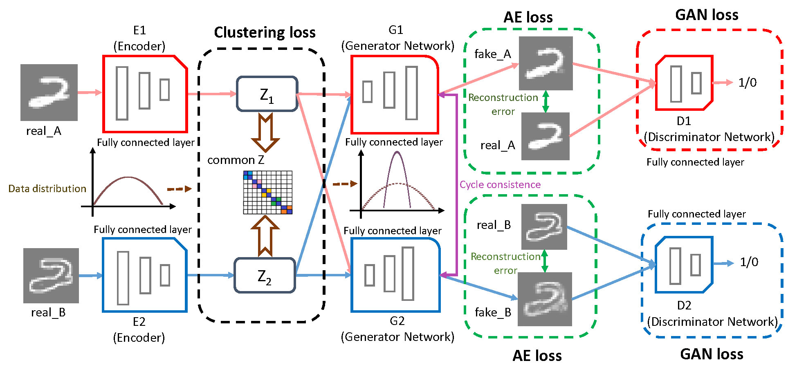

#Partial Multi-view Clustering via Consistent GAN#

This repo contains the source code and dataset for our ICDM paper:

**Qianqian Wang**, Zengming Ding, Zhiqiang Tao, Quanxue Gao and Yun Fu, Partial Multi-view Clustering via Consistent GAN, IEEE ICDM, 2018: 1290-1295.

[paper link](https://ieeexplore.ieee.org/abstract/document/8594983)

@inproceedings{2018Partial,  
   title={Partial Multi-view Clustering via Consistent GAN},  
   author={ Wang, Qianqian  and  Ding, Zhengming  and  Tao, Zhiqiang  and  Gao, Quanxue  and  Fu, Yun },  
   booktitle={2018 IEEE International Conference on Data Mining (ICDM)},  
   year={2018},  
}  


**PVC-GAN Model:**

<div style="text-align: center; width: 900px; border: green solid 1px;">

<br></br>
<center>Figure 1: Network Model</center>
</div>


**Introduction**

With the development of data collection and feature extraction methods, nowadays, multi-view data are easily to obtain. Multi-view clustering, as one of the most important methods to analyze this kind of data, has been widely used in many real-world applications. Most existing multi-view clustering methods perform well on the assumption that each sample appears in all views. Nevertheless, in real-world application, each view may well face the problem of the data missing due to noise or malfunction or equipments malfunction. In this paper, a new consistent generative adversarial network is proposed for partial multi-view clustering. We learn a common low-dimensional representation, which can both generate the missing view data and capture a better common structure from partial multi-view data for clustering. Different from the most existing methods, we use the common representation encoded by one view to generate the missing data of the corresponding view by generative adversarial networks, then we use the encoder and clustering networks. This is intuitive and meaningful because encoding common representation and generating the missing data in our model will promote mutually. To be specific, the common representation learned by encoder networks can help impute the missing view data and the generated missing view data can put forward to learn a more consistent low-dimensional representation. Experimental results on three different multi-view databases illustrate the superiority of the proposed method.

<div style="text-align: center; width: 900px; border: green solid 1px;">

<br></br>
<center>Figure 2: Illustration of partial multi-view data with image and text views</center>
</div>

<div style="text-align: center; width: 900px; border: green solid 1px;">

<br></br>
<center>Figure 3: Illustration for multi-view data</center>
</div>

<div style="text-align: center; width: 900px; border: green solid 1px;">

<br></br>
<center>Figure 4: The framework of cycle GAN</center>
</div>


**Dataset:**

 BDGP is a two-view database. One is visual view and the other is textual view. It contains 2,500 images about drosophila embryos belonging to 5 categories. Each image is represented by a 1,750-D visual vector and a 79-D textual feature vector. In our experiment, we use all data on BDGP database, and evaluate the performance on both visual feature and textual feature.

**Requirements**  
Python 3.6  
PyTorch 1.0  
**Train the model**  
<!--
<table><tr><td bgcolor=Gainsboro	 width="900">python train.py  </td></tr></table>  
-->
```
python train.py
``` 


**Acknowledgments**

Code is inspired by [VIGAN](https://github.com/chaoshangcs/VIGAN) [CycleGAN](https://github.com/chaoshangcs/pytorch-CycleGAN-and-pix2pix).

